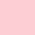
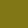
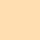

# Recommended ROS colors

The Google Material Design color system is a comprehensive design language which can be also used in ROS and Rviz. For convenience it is listed here, and hex valuses (eg `#F44336`) are converted to rgb (eg `0.96 0.26 0.21`) which is common representation in ROS. If you need in `0-255` range, simply multiply the `0-1` rgb by `255`.

| `100`  | `500` | `900` 
|---|---|---
| 1.00 0.80 0.82 |  0.96 0.26 0.21 `md_red_500` |  0.72 0.11 0.11 
| 0.97 0.73 0.82| 0.91 0.12 0.39 `md_pink_500`|  0.53 0.05 0.31 
| 0.82 0.77 0.91 |  0.40 0.23 0.72 `md_deep_purple_500` | 0.19 0.11 0.57 
| 0.73 0.87 0.98 | 0.13 0.59 0.95 `md_blue_500`| 0.05 0.28 0.63 
| 0.70 0.87 0.86 | 0.00 0.59 0.53 `md_teal_500` | 0.00 0.30 0.25 
| 0.78 0.90 0.79 | 0.30 0.69 0.31 `md_green_500` | 0.11 0.37 0.13 
| 0.94 0.96 0.76 | 0.80 0.86 0.22 `md_lime_500` | 0.51 0.47 0.09 
| 1.00 0.93 0.70 | 1.00 0.76 0.03 `md_amber_500` | 1.00 0.44 0.00 
| 1.00 0.88 0.70 | 1.00 0.60 0.00 `md_orange_500` | 0.90 0.32 0.00 
| 0.84 0.80 0.78 | 0.47 0.33 0.28 `md_brown_500` | 0.24 0.15 0.14 
| 0.96 0.96 0.96 | 0.62 0.62 0.62 `md_grey_500`| 0.13 0.13 0.13 

# Code examples

## c++
```cpp
const float md_red_500_r = 0.96, md_red_500_g = 0.26, md_red_500_b = 0.21;
const float md_deep_purple_500_r = 0.40, md_deep_purple_500_g = 0.23, md_deep_purple_500_b = 0.72;
const float md_indigo_500_r = 0.25, md_indigo_500_g = 0.32, md_indigo_500_b = 0.71;
const float md_blue_500_r = 0.13, md_blue_500_g = 0.59, md_blue_500_b = 0.95;
const float md_green_500_r = 0.30, md_green_500_g = 0.69, md_green_500_b = 0.31;
const float md_yellow_500_r = 1.00, md_yellow_500_g = 0.92, md_yellow_500_b = 0.23;
const float md_amber_500_r = 1.00, md_amber_500_g = 0.76, md_amber_500_b = 0.03;
const float md_orange_500_r = 1.00, md_orange_500_g = 0.60, md_orange_500_b = 0.00;
const float md_brown_500_r = 0.47, md_brown_500_g = 0.33, md_brown_500_b = 0.28;
```
## python
```python 
md_red_500_r = 0.96, md_red_500_g = 0.26, md_red_500_b = 0.21
md_pink_500_r = 0.91, md_pink_500_g = 0.12, md_pink_500_b = 0.39
md_deep_purple_500_r = 0.40, md_deep_purple_500_g = 0.23, md_deep_purple_500_b = 0.72
md_blue_500_r = 0.13, md_blue_500_g = 0.59, md_blue_500_b = 0.95
md_cyan_500_r = 0.00, md_cyan_500_g = 0.74, md_cyan_500_b = 0.83
md_green_500_r = 0.30, md_green_500_g = 0.69, md_green_500_b = 0.31
md_yellow_500_r = 1.00, md_yellow_500_g = 0.92, md_yellow_500_b = 0.23
md_amber_500_r = 1.00, md_amber_500_g = 0.76, md_amber_500_b = 0.03
md_orange_500_r = 1.00, md_orange_500_g = 0.60, md_orange_500_b = 0.00
md_brown_500_r = 0.47, md_brown_500_g = 0.33, md_brown_500_b = 0.28
md_grey_500_r = 0.62, md_grey_500_g = 0.62, md_grey_500_b = 0.62
```
# Links
- [material.io/resources/color](https://material.io/resources/color/#!/?view.left=0&view.right=0&primary.color=F44336)
- [materialui.co/colors](https://materialui.co/colors)
